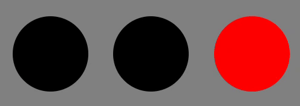

## Traffic Light Problem

Build a traffic light where the lights switch from green to yellow to red after predetermined intervals and loop indefinitely. Each light should be lit for the following durations:

**Red light:** 4000ms  
**Yellow light:** 500ms  
**Green light:** 3000ms

## Preview

